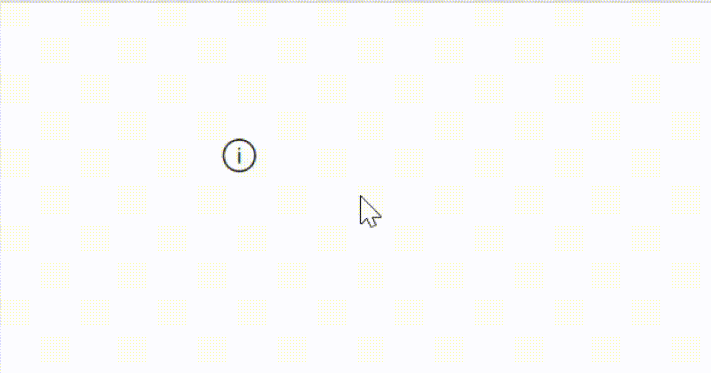

# Tooltip PCF Code Component



This PCF code component follows in the steps of [Power CAT Code Components](https://github.com/microsoft/powercat-code-components) and creates a wrapper around the [Fluent UI Tooltip](https://developer.microsoft.com/en-us/fluentui#/controls/web/tooltip) control for use inside of Canvas Apps. 

## Configuration
The control accepts the following properties:
### Content Properties
- **Content** - the text to display inside the tooltip. In the future, I'd like this to follow more closely to the Fluent UI tooltip usage, e.g., custom content etc. 
- **IconName** - the Fluent UI icon to display (see [Fluent UI icons](https://developer.microsoft.com/en-us/fluentui#/styles/web/icons))
- **IconColor** - the color to render the icon, e.g., named, rgb, or hex value. Default is 'black'
- **Width** - the width of the control. Default value is 24
- **Height** - the height of the control. Default value is a 24
- **IconSize** - sets the size of the icon. Default value is 26
- **FillColor** - the color to render background color. e.g., named, rgb, or hex value. Default is 'transparent'

### Style Properties
- **Theme** - Accepts a JSON string that is generated using [Fluent UI Theme Designer (windows.net)](https://fabricweb.z5.web.core.windows.net/pr-deploy-site/refs/heads/master/theming-designer/). Leaving this blank will use the default theme defined by Power Apps. 
    - Read the updated [theming documentation](https://docs.microsoft.com/en-us/power-platform/guidance/creator-kit/theme) 
- **Accessibility label** - Screen reader aria-label


### Example Theme

*Note: the below is from the Power CAT code components [Nav control README.md](https://github.com/microsoft/powercat-code-components/tree/main/Nav#example-theme)*


The following is an example of setting the theme based on the output from the [Fluent UI Theme Designer (windows.net)](https://fabricweb.z5.web.core.windows.net/pr-deploy-site/refs/heads/master/theming-designer/). 

```
Set(varThemeBlue, {
  palette: {
    themePrimary: ColorValue("#0078d4"),
    themeLighterAlt: ColorValue("#eff6fc"),
    themeLighter: ColorValue("#deecf9"),
    themeLight: ColorValue("#c7e0f4"),
    themeTertiary: ColorValue("#71afe5"),
    themeSecondary: ColorValue("#2b88d8"),
    themeDarkAlt: ColorValue("#106ebe"),
    themeDark: ColorValue("#005a9e"),
    themeDarker: ColorValue("#004578"),
    neutralLighterAlt: ColorValue("#faf9f8"),
    neutralLighter: ColorValue("#f3f2f1"),
    neutralLight: ColorValue("#edebe9"),
    neutralQuaternaryAlt: ColorValue("#e1dfdd"),
    neutralQuaternary: ColorValue("#d0d0d0"),
    neutralTertiaryAlt: ColorValue("#c8c6c4"),
    neutralTertiary: ColorValue("#a19f9d"),
    neutralSecondary: ColorValue("#605e5c"),
    neutralPrimaryAlt: ColorValue("#3b3a39"),
    neutralPrimary:ColorValue( "#323130"),
    neutralDark: ColorValue("#201f1e"),
    black: ColorValue("#000000"),
    white: ColorValue("#ffffff")
  }});

Set(varThemeBlueJSON,"{""palette"":{
  ""themePrimary"": ""#0078d4"",
  ""themeLighterAlt"": ""#eff6fc"",
  ""themeLighter"": ""#deecf9"",
  ""themeLight"": ""#c7e0f4"",
  ""themeTertiary"": ""#71afe5"",
  ""themeSecondary"": ""#2b88d8"",
  ""themeDarkAlt"": ""#106ebe"",
  ""themeDark"": ""#005a9e"",
  ""themeDarker"": ""#004578"",
  ""neutralLighterAlt"": ""#faf9f8"",
  ""neutralLighter"": ""#f3f2f1"",
  ""neutralLight"": ""#edebe9"",
  ""neutralQuaternaryAlt"": ""#e1dfdd"",
  ""neutralQuaternary"": ""#d0d0d0"",
  ""neutralTertiaryAlt"": ""#c8c6c4"",
  ""neutralTertiary"": ""#a19f9d"",
  ""neutralSecondary"": ""#605e5c"",
  ""neutralPrimaryAlt"": ""#3b3a39"",
  ""neutralPrimary"": ""#323130"",
  ""neutralDark"": ""#201f1e"",
  ""black"": ""#000000"",
  ""white"": ""#ffffff""
}
}");
```

The Theme JSON string is passed to the component property, whilst the varTheme can be used to style other standard components such as buttons using the individual colors.